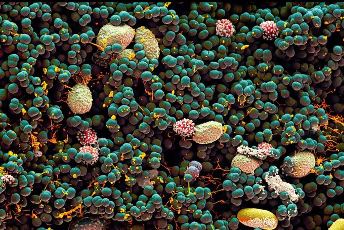
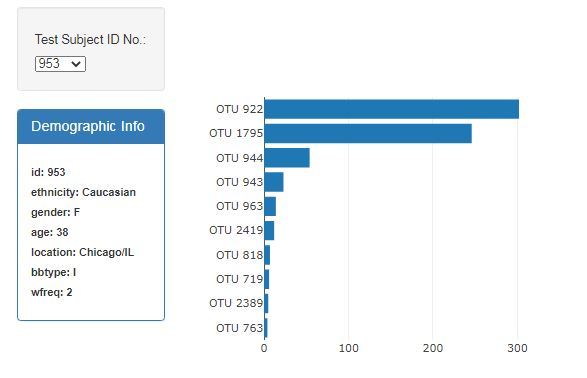

# Belly Button Biodiversity
Built an interactive dashboard to explore the Belly Button Biodiversity dataset, which catalogs the microbes that colonize human navels.  

The dashboard consists of four elements:
1. Demographic card
2. Bar graph
3. Gauge graph
4. Bubble chart

The dasboard allows to choose the individual ID using the dropdown menu which has been added using html and bootstrap. On selecting a particular ID all the four elements refreshes displaying corresponding subject information. 

The bar graph has been created using Plotly and displays the top 10 microbial species (OTU's) found in the particular individual and card shows the demographic information of the selected individual.  

